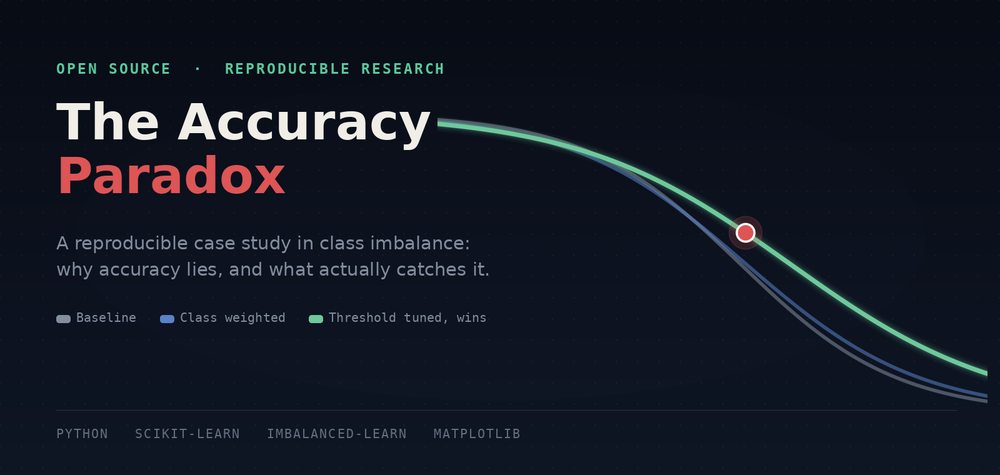

<div align="center">



<br/>

[](#)
[](#)
[](#)
[](LICENSE)

</div>

<br/>

<div align="center">

> **A model that's right 98 times out of 100 sounds like the best model in the room. It isn't.**
> It might be the one quietly missing every case that actually mattered, and the only way to know is to stop trusting the one number everyone hands you first.

</div>

<br/><br/>

## Why this exists

Class imbalance is the default condition of most real classification problems: rare disease detection, fraud, manufacturing defects, network intrusions, churn. Accuracy, the metric almost everyone reaches for first, actively lies in exactly these settings. It doesn't just underperform, it rewards the laziest possible model with the highest possible score.

This repository is the full, reproducible proof of that claim. A synthetic 98%/2% imbalanced dataset, a baseline model that looks great and does nothing, the confusion matrix that exposes it, and three standard fixes tested honestly enough that one of them makes things worse. Every number in the article traces back to the notebook in this repo. Nothing here is illustrative or hand-picked.

<br/>

<div align="center">

---


</div>

<br/>

## The finding, in one table

<div align="center">

| Method | Accuracy | Precision | Recall | F1 |
|:--|:--:|:--:|:--:|:--:|
| Predict majority always | 0.9748 | 0.0000 | 0.0000 | 0.0000 |
| Baseline (unweighted Random Forest) | 0.9804 | 0.9667 | 0.2302 | 0.3718 |
| **Threshold tuned** | 0.9842 | 0.7474 | 0.5635 | **0.6425** |
| Class weighted | 0.9776 | 1.0000 | 0.1111 | 0.2000 |
| SMOTE | 0.9812 | 0.7286 | 0.4048 | 0.5204 |

*Every method scores between 97.5% and 98.4% accuracy. Recall and F1 tell a completely different story, and that gap is the entire point of this project.*

</div>

<br/><br/>

## Repository structure

---

accuracy-paradox-demo/
│
├── article.md                      Full write-up: math, code, findings, checklist
├── README.md                       You are here
├── LICENSE                         MIT
├── requirements.txt                Exact dependencies to reproduce every result
│
├── notebook/
│   └── imbalance_analysis.ipynb    End-to-end, runnable top to bottom: data → models → every figure
│
└── figures/
    ├── readme_banner.png                   This page's header image
    ├── banner.png                          Cover image used in article.md and on Medium
    ├── fig1_accuracy_vs_recall.png         Accuracy vs. recall, baseline vs. do-nothing model
    ├── fig2_confusion_baseline.png         Confusion matrix, baseline model
    ├── fig3_pr_curve_baseline.png          Precision-recall curve, baseline model
    ├── fig4_pr_curve_comparison.png        Precision-recall curves, all fixes compared
    ├── fig5_confusion_weighted.png         Confusion matrix, class-weighted model
    ├── fig6_full_comparison.png            All five methods, every metric, side by side
    ├── table_results_summary.png           Results table, styled for visual publishing
    └── equations/
        ├── eq_accuracy.png
        ├── eq_recall.png
        ├── eq_precision.png
        └── eq_f1.png
```

<br/>

<div align="center">

---


</div>

<br/>

## What's inside the dataset

A synthetic, fully reproducible stand-in for a medical-imaging screening problem, built with `sklearn.datasets.make_classification`:

| Property | Value |
|:--|:--|
| Samples | 20,000 |
| Features | 20 (8 informative, 4 redundant) |
| Class split | 98% normal, 2% disease |
| Label noise | 1% (`flip_y=0.01`, kept realistic rather than a clean toy split) |
| Seed | 42, fixed everywhere for exact reproducibility |

<br/><br/>

## The three fixes, tested honestly

| Fix | What it does | What actually happened here |
|:--|:--|:--|
| **Class weighting** | Penalizes minority-class errors more during training, one keyword argument | Recall *dropped* on this model and dataset, a real and known failure mode with bagged tree ensembles, not a universal result |
| **SMOTE** | Synthetically oversamples the minority class in the training fold only | Recall roughly doubled, at the cost of more false alarms |
| **Threshold tuning** | Moves the decision boundary off the default 0.5 to maximize F1 | The cheapest fix, and the one that won outright on this run |

No result here is presented as the correct outcome to expect on every dataset. The point of showing all three, with the full precision-recall curves and confusion matrices behind them, is that the standard advice ("just use `class_weight='balanced'`") is not guaranteed to help. It has to be checked, not assumed, and this repo shows exactly how to check it.

<br/>

<div align="center">

---


</div>

<br/>

## Reproduce it

```bash
git clone https://github.com/zain-ul-abideen-5036/accuracy-paradox-demo.git
cd accuracy-paradox-demo

python -m venv venv
source venv/bin/activate        # Windows: venv\Scripts\Activate.ps1

pip install -r requirements.txt

jupyter notebook notebook/imbalance_analysis.ipynb
```

Run the notebook top to bottom. Every figure in `figures/` regenerates from scratch, and the printed metrics table will match the one above exactly, since every random process in the pipeline is seeded.

Want to test it on your own data instead of the synthetic set? Replace the `make_classification(...)` cell near the top with your own `X, y`. Everything downstream, the models, the metrics, every figure, adapts automatically to any binary classification problem.

<br/><br/>

## Read the full write-up

The complete article, including the math behind why accuracy fails, the full walkthrough of the confusion matrix, and the checklist for auditing any reported accuracy number, lives in [`article.md`](article.md) in this repo, and is also published on Medium.

<div align="center">

**[Read "Your Model Has 98% Accuracy and Is Completely Useless" on Medium →](#)**

</div>

<br/>

<div align="center">

---


</div>

<br/>

## Why this matters beyond this one dataset

This case study is a direct extension of imbalance problems that show up constantly in real diagnostic imaging work: CT-based classification where the disease-positive class is a small minority of scans, and where a model that quietly ignores that minority can still report a deceptively strong headline accuracy. The habit this repo argues for, confusion matrix first, accuracy last, is the same discipline behind catching subject-level data leakage and validation-pipeline leaks before they inflate a reported result anywhere else.

<br/>

## License

Released under the [MIT License](LICENSE). Use the code freely. If you reference the article or its findings, an attribution back to this repository or the Medium piece is appreciated.

<br/><br/>

---

<br/>

<div align="center">

## About the Author


<br/><br/>

### Zain Ul Abideen

</div>

I work at the intersection of applied machine learning and computer vision, mostly living in the space between a model that runs and a model that can be trusted. That usually means chasing down the quiet failure modes that a headline metric hides: data leakage, mismatched validation splits, and, as this repository shows, accuracy scores that look great and mean nothing.

I graduated in Computer Science from the University of Central Punjab, Lahore, with a minor in AI, ML, and Deep Learning, and I currently work as a Lead AI/ML Instructor while holding a Senior Microsoft Learn Student Ambassador (Gold) role. Alongside that, I take on applied ML engineering work for external clients and collaborate on graduate-level research, most recently redesigning the validation methodology and statistical testing for an MSc dissertation on deep transfer learning.

This repository is part of a broader, ongoing body of public research work: reproducible case studies, each one built to be run, questioned, and verified rather than taken on faith. Every piece follows the same rule this one does: if the honest result is a fix that underperforms or a number that doesn't move the way it's supposed to, that stays in, because that's usually the more useful finding.

<br/>

<div align="center">

[](https://github.com/zain-ul-abideen-5036)
[](https://linkedin.com/in/zain-ul-abideen3)

<br/>

*If this repository helped you catch a false 98%, a star is the best kind of feedback.*

</div>
