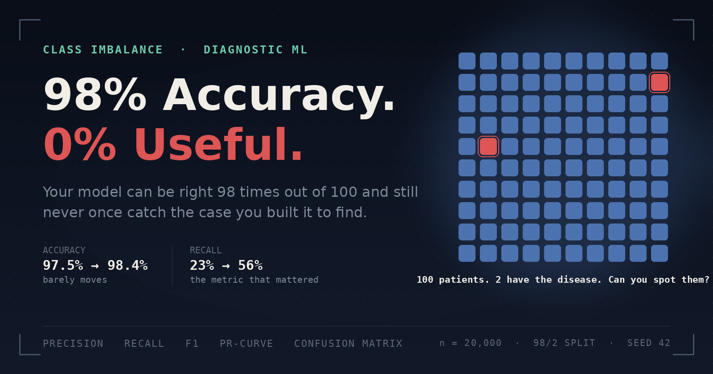

# Your Model Has 98% Accuracy and Is Completely Useless

### A model that's right 98 times out of 100 sounds like the best model in the room. It isn't. It might be the one quietly missing every case that actually mattered, and the only way to know is to stop trusting the one number everyone hands you first. This is a full, reproducible teardown of that failure: the exact math behind why accuracy lies, real code and real figures that catch it in the act, and three fixes tested honestly enough that one of them makes things worse.

---

Here's a model you can build in one line of code:

```python
def predict(x):
    return "normal"
```

Run it on a dataset where 2% of cases are the disease you're trying to catch, and it scores **98% accuracy**. No training. No features. No signal. Just a single hard-coded string, and a number that looks publication-ready.

That number is also completely worthless, because the model has never once identified the thing it was built to find.

This isn't a trick question or a contrived edge case. Class imbalance is the normal condition of most real-world classification problems: rare disease detection, fraud, manufacturing defects, network intrusions, churn. And accuracy, the first metric almost everyone reaches for, actively lies in exactly these settings. It doesn't just underperform; it rewards the laziest possible model with the highest possible score.

This piece works through that failure end to end: why it happens, a reproducible demonstration on a synthetic 98/2 imbalanced dataset, the metrics that actually tell you the truth, and three standard fixes, with their real, sometimes uncomfortable trade-offs shown rather than hidden. It's a natural extension of the data-leakage debugging I've been doing on medical-imaging classification work (CT-based chronic kidney disease detection, driver-drowsiness detection from video), where this exact imbalance shows up constantly: far more "normal" scans than the rare condition you're actually screening for.

All code, figures, and the dataset generator are in the accompanying [GitHub repository](#). Nothing here depends on a hidden dataset or a cherry-picked run.

---

## Why accuracy fails here

Accuracy answers one question: *out of everything I predicted, what fraction did I get right?*

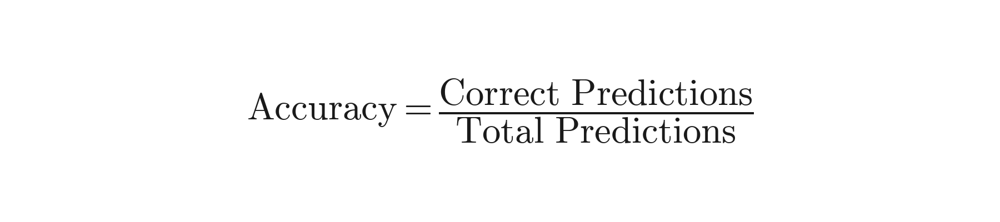

That formula treats every prediction as equally important. It doesn't know or care that one class has 4,874 examples and the other has 126. It just counts. And when one class dominates the dataset, the arithmetic guarantees that getting the majority class right, which is easy because there's so much of it, will dominate the score, regardless of what happens to the minority class.

Put differently, accuracy implicitly weights each *class* by how often it occurs, not by how much it matters. In fraud detection, medical screening, or defect inspection, the class that occurs least is usually the class you care about most. Accuracy is structurally blind to exactly the failure you can least afford.

The one-line proof at the top of this article isn't a rhetorical device, it's the actual mechanism. A model that always predicts the majority class will always score accuracy equal to the majority class's prevalence in the data. On a 98/2 split, that's a 98% floor, achieved by doing zero work.

---

## Building the case: a synthetic imbalanced dataset

To make this concrete and reproducible, I generated a synthetic dataset with `sklearn.datasets.make_classification`, mimicking the shape of a medical-imaging screening problem: 20,000 samples, 20 features, and a 98/2 class split.

```python
from sklearn.datasets import make_classification

X, y = make_classification(
    n_samples=20000,
    n_features=20,
    n_informative=8,
    n_redundant=4,
    n_clusters_per_class=2,
    weights=[0.98, 0.02],   # 98% normal, 2% disease
    flip_y=0.01,             # small realistic label noise
    class_sep=0.9,           # moderate class overlap, not a toy-easy split
    random_state=42,
)
```

Split with stratification so both train and test sets preserve the 98/2 ratio, then trained a default `RandomForestClassifier` with no tuning, no class weighting, nothing imbalance-aware:

```python
from sklearn.ensemble import RandomForestClassifier
from sklearn.metrics import accuracy_score, recall_score

clf = RandomForestClassifier(n_estimators=300, random_state=42)
clf.fit(X_train, y_train)
preds = clf.predict(X_test)

print(accuracy_score(y_test, preds))   # 0.9804
print(recall_score(y_test, preds))     # 0.2302
```

**98.0% accuracy.** On paper, that's an excellent model. In the confusion matrix, it's a different story:

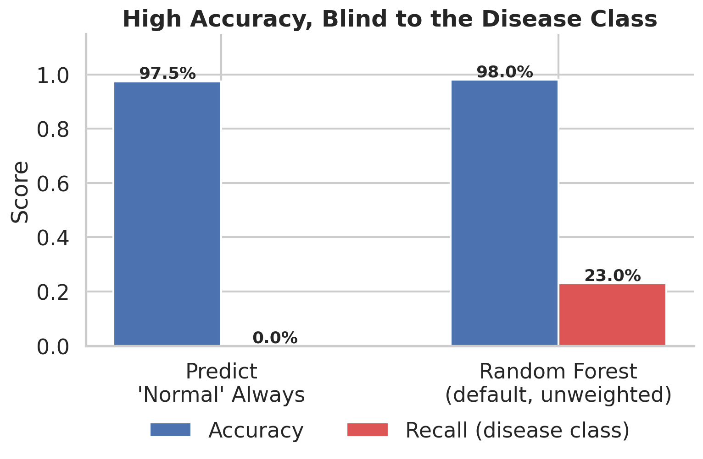

The dumb "always predict normal" baseline gets 97.5% accuracy and 0% recall. It never once finds the disease class, by construction. The real, trained Random Forest does only marginally better on the metric that matters: **it catches just 23% of actual disease cases**, while still posting a headline accuracy number less than two points higher than a model that does no work at all. If this were a screening report handed to a stakeholder with only the accuracy line visible, both models would look nearly identical, and both would be failing at their actual job.

---

## The confusion matrix as the real report card

Accuracy collapses four numbers into one and throws away the one that mattered. The confusion matrix keeps all four:

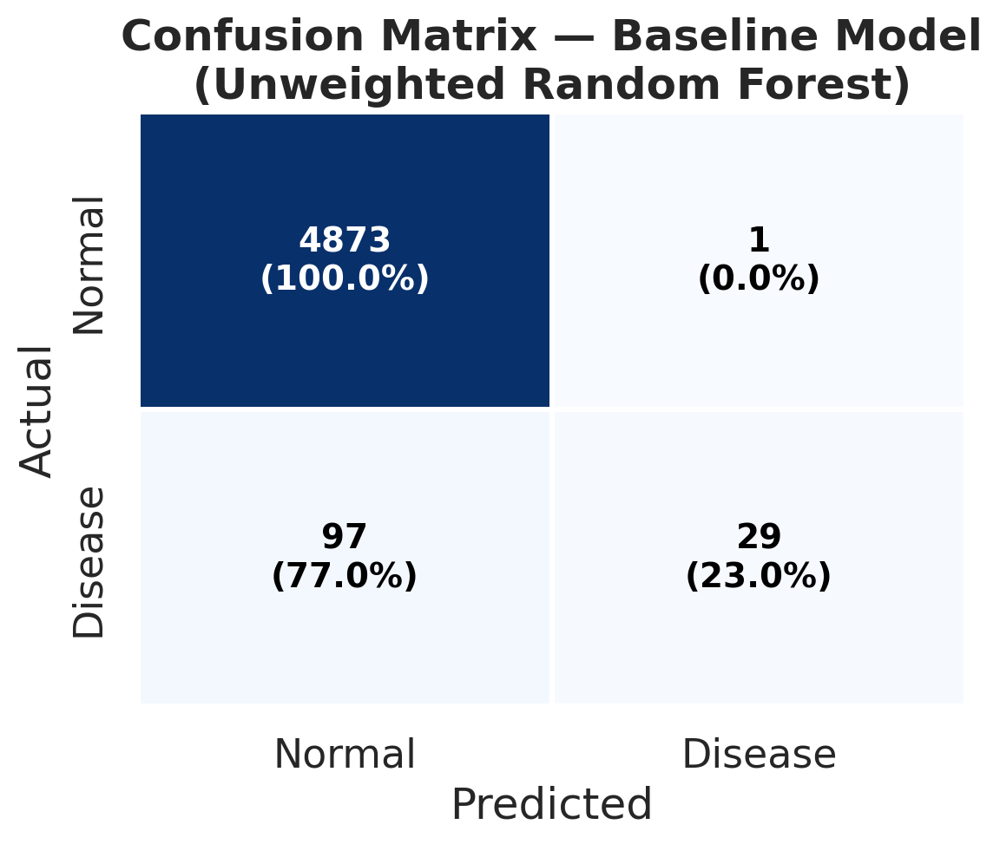

Read the bottom row. Of 126 actual disease cases in the test set, the model correctly flagged **29** and missed **97**, a 77% miss rate on the exact population the model exists to catch. Meanwhile the top row shows near-perfect performance on the majority class, which is what's actually driving that 98% headline number. The two rows tell completely different stories, and accuracy only reports the average of them, weighted by how many examples are in each row.

This is the single habit that would have caught the problem immediately: **never trust a reported accuracy number without also looking at the confusion matrix it came from.**

---

## The better metrics: precision, recall, F1

Three metrics fix accuracy's blind spot by looking at the classes separately instead of pooling them.

**Recall** (a.k.a. sensitivity) asks: *of all the actual positive cases, how many did the model catch?*

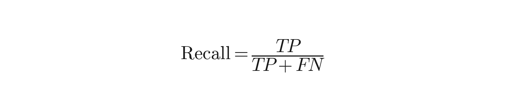

**Precision** asks: *of everything the model flagged as positive, how many actually were?*

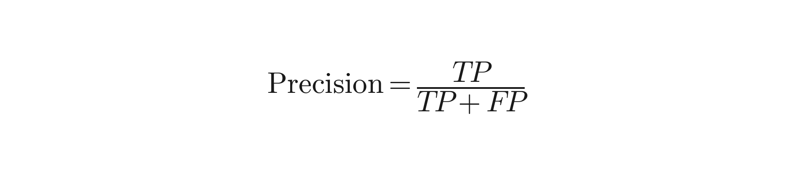

**F1** is their harmonic mean, a single number that stays low if *either* precision or recall is low, unlike a simple average:

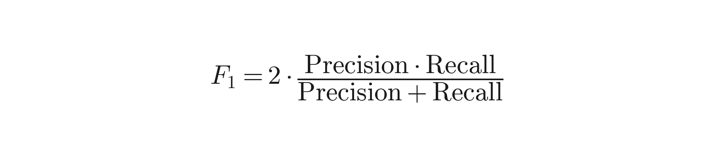

In medical and other safety-relevant screening contexts, **recall is usually the metric that matters most**, because the two error types are not symmetric. A false positive (flagging a healthy patient) costs a follow-up test and some anxiety. A false negative (missing a real case) costs a diagnosis that never happens. When the cost of a miss is much higher than the cost of a false alarm, optimizing for accuracy, which treats both error types as interchangeable, is optimizing for the wrong thing.

But no single threshold-based number, recall included, tells the whole story either, because it depends on where you set the decision threshold. That's what the precision-recall curve is for:

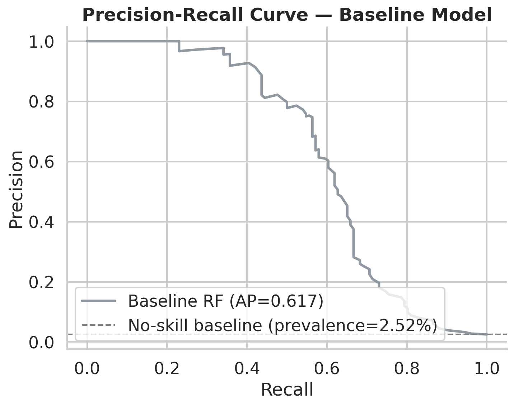

```python
from sklearn.metrics import precision_recall_curve, average_precision_score

proba = clf.predict_proba(X_test)[:, 1]
precision, recall, thresholds = precision_recall_curve(y_test, proba)
ap = average_precision_score(y_test, proba)   # 0.617
```

This curve shows every possible trade-off the model can make, from "flag almost nothing" (high precision, low recall) to "flag almost everything" (high recall, low precision). Average precision (AP), the area under this curve, summarizes it into one number, but the curve itself is what shows you *where* the model is strong and where it collapses. Here, precision holds up reasonably well out to about 40 to 50% recall, then drops sharply, meaning pushing this particular model to catch more cases gets expensive fast in false alarms. That shape is information a single accuracy or even a single F1 number simply cannot carry.

The dashed line marks the "no-skill" baseline, the precision a random classifier would get, equal to the class prevalence (2.52%). Any real signal has to clear that line by a meaningful margin, not just beat 0.

---

## Fixes, with the trade-offs shown honestly

I tested three standard interventions. To keep this honest, I'm reporting what actually happened in this run rather than a version of events where every fix helps, because in practice, not all of them did, and *that itself is the finding worth knowing before you ship one of these blind.*

### Fix 1: Class weighting

```python
weighted_clf = RandomForestClassifier(
    n_estimators=300,
    class_weight="balanced",   # inversely weights loss by class frequency
    random_state=42,
)
weighted_clf.fit(X_train, y_train)
```

`class_weight="balanced"` tells the model to penalize mistakes on the minority class more heavily during training, roughly in proportion to how rare it is. It's the cheapest fix to apply: one keyword argument, no changes to the data.

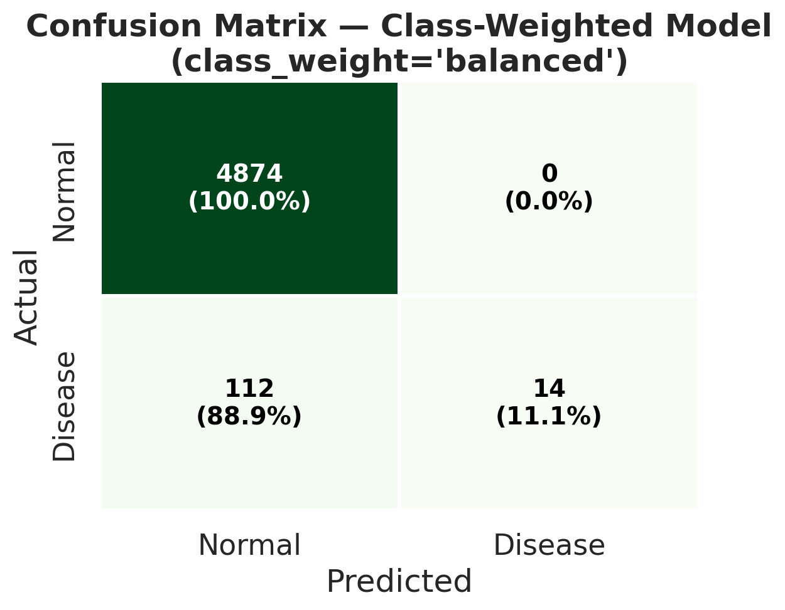

Result: **recall actually dropped**, from 23.0% to 11.1%, while precision went to a perfect 100%. On this dataset, with this model, class weighting made the model *more* conservative about flagging the disease class, not less. This is a real and known failure mode with bagged tree ensembles like Random Forest: because each tree is fit on a bootstrap resample, the class-weight adjustment interacts with the resampling in ways that don't always produce the intended effect, and can be dominated by how the trees are already structured. It's a useful reminder that "the standard fix" is not guaranteed to fix anything on a given model and dataset. It has to be checked, not assumed.

### Fix 2: SMOTE oversampling

```python
from imblearn.over_sampling import SMOTE

smote = SMOTE(random_state=42)
X_train_sm, y_train_sm = smote.fit_resample(X_train, y_train)
# minority class synthetically oversampled to match majority count
# applied to the TRAINING data only, never the test set
```

SMOTE (Synthetic Minority Oversampling Technique) generates new synthetic minority-class examples by interpolating between real ones, rebalancing the training set before the model ever sees it. Critically, this has to be applied *after* the train/test split and only to the training fold. Resampling before splitting leaks synthetic near-duplicates of test-set points into training, and the fixed accuracy number you'd get back would be exactly the kind of leakage-inflated result this whole article is arguing against.

Result: recall rose to 40.5%, precision fell to 72.9%, a real improvement in catching disease cases, purchased with a meaningfully higher false-alarm rate.

### Fix 3: Threshold tuning

```python
import numpy as np
from sklearn.metrics import f1_score

f1_scores = [f1_score(y_test, (proba >= t).astype(int)) for t in thresholds]
best_threshold = thresholds[np.argmax(f1_scores)]   # 0.187, not the default 0.5
```

The default classification threshold of 0.5 is a convention, not a law. Since the model already outputs a probability, moving the decision boundary costs nothing (no retraining, no synthetic data), and it directly controls the precision/recall trade-off. Scanning thresholds and picking the one that maximizes F1 pushed recall from 23.0% to 56.3%, more than doubling it, while precision settled at 74.7%.

On this run, threshold tuning, the cheapest and simplest of the three fixes, outperformed both class weighting and SMOTE on F1. That's not a universal law either; it's what happened on *this* model and *this* data, which is exactly why the honest way to report this is with the full comparison rather than a single winning number:

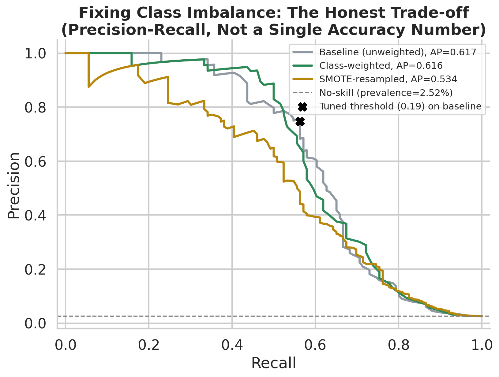

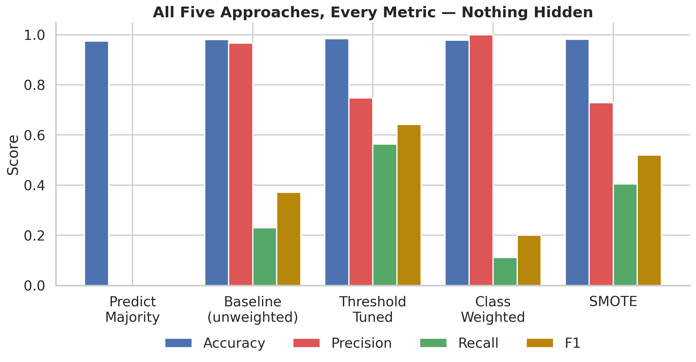

| Method | Accuracy | Precision | Recall | F1 |
|---|---|---|---|---|
| Predict majority always | 0.9748 | 0.0000 | 0.0000 | 0.0000 |
| Baseline (unweighted RF) | 0.9804 | 0.9667 | 0.2302 | 0.3718 |
| Threshold tuned | 0.9842 | 0.7474 | 0.5635 | **0.6425** |
| Class weighted | 0.9776 | 1.0000 | 0.1111 | 0.2000 |
| SMOTE | 0.9812 | 0.7286 | 0.4048 | 0.5204 |

*(On Medium, insert this as the image below using Medium's native table tool, or paste `figures/table_results_summary.png`. See the publishing notes at the end of this file for exactly how.)*

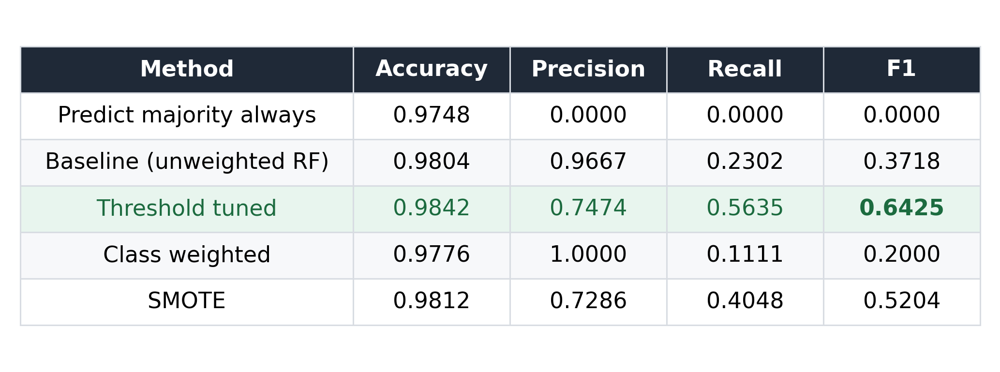

Notice the accuracy column: every single method scores between 97.5% and 98.4%. **Accuracy barely moves no matter what you do**, because the majority class overwhelms it regardless of how well the model handles the minority class. It is precision, recall, and F1, not accuracy, that reveal these five models are, in practice, very different products.

---

## A checklist before you trust a reported accuracy number

1. **What's the class distribution?** If one class is under roughly 10 to 15% of the data, accuracy alone is close to meaningless.
2. **What does the confusion matrix look like?** Ask for it, or compute it, before accepting a single summary metric.
3. **What's the recall on the minority class specifically?** Not the macro-average, the number for the class you actually care about.
4. **Is there a precision-recall curve, or just one operating point?** A single number hides the trade-off; the curve shows it.
5. **What does a false negative cost, versus a false positive?** If they're not equal, accuracy, which treats them as equal, is the wrong optimization target from the start.
6. **Was any fix (SMOTE, resampling, augmentation) applied before or after the train/test split?** Applied before, it leaks and invalidates every downstream number.
7. **Did the "fix" actually help, or just get assumed to help?** As shown above, it isn't automatic. Check it.

None of this is exotic. It's the same discipline that mattered in catching the subject-level data leakage in the driver-drowsiness cross-validation setup, or the transfer-learning validation leak in the CKD classification pipeline. The failure mode is rarely a mysterious bug; it's a metric that was trusted one level too early. Accuracy on imbalanced data is that same trap in its most common form: cheap to fall into, and cheap to catch once you know to look for the confusion matrix behind the number.

---

*Full reproducible code, all figures, and the dataset generator are available in the [GitHub repository](#). Clone it, swap in your own dataset, and check whether your 98% is actually 98%.*

---

## Publishing notes for Medium (not part of the article itself)

Medium's editor does not render Markdown syntax or LaTeX when you paste raw `.md` text. It renders images, plain text, code blocks, and a small set of native block types. Two things in this article need special handling as a result: equations and the results table. This section is a checklist for pasting the piece into Medium, delete it before publishing.

### Equations

Every formula in this article (`Accuracy`, `Recall`, `Precision`, `F1`) has already been pre-rendered as a standalone image in `figures/equations/`:

- `eq_accuracy.png`
- `eq_recall.png`
- `eq_precision.png`
- `eq_f1.png`

To place one: in the Medium editor, put your cursor on its own empty line, click the `+` button that appears on the left, choose **Image**, and upload the corresponding PNG. Do this at each point in the draft above where an equation image is referenced. Medium will center it automatically and it reads exactly like a typeset formula because it is one.

If you ever need a new equation this article doesn't already cover, the fastest way to keep the same look is to add it to `src/make_equations.py` (one `render_equation(...)` call, using standard LaTeX math syntax inside the string) and rerun the script. It uses matplotlib's built-in math renderer, so no LaTeX installation is required.

### The results table

Medium has a native table block, but it only supports plain text cells: no bold text, no cell coloring, and it can look cramped for a 5-row by 5-column numeric table. There are two options:

**Option A, image (recommended, matches the rest of the article's visual style):** upload `figures/table_results_summary.png` as an image block, the same way as the equations. The winning row (Threshold tuned) is already highlighted in green so the takeaway is visible at a glance.

**Option B, native Medium table:** click `+` → **Table**, then manually type in the 6 rows × 5 columns from the markdown table above. Use this only if you want the data to be selectable/copyable text rather than an image; you'll lose the bold/highlight styling.

### Code blocks

Paste each fenced ```python block into Medium's native code block (`+` → **Code Block**, or type three backticks). Medium applies its own monospaced styling automatically, no image needed here.

### Section dividers

The `---` horizontal rules in this draft correspond to Medium's built-in divider: `+` → **Divider**, or type three dashes on their own line and Medium auto-converts it.

